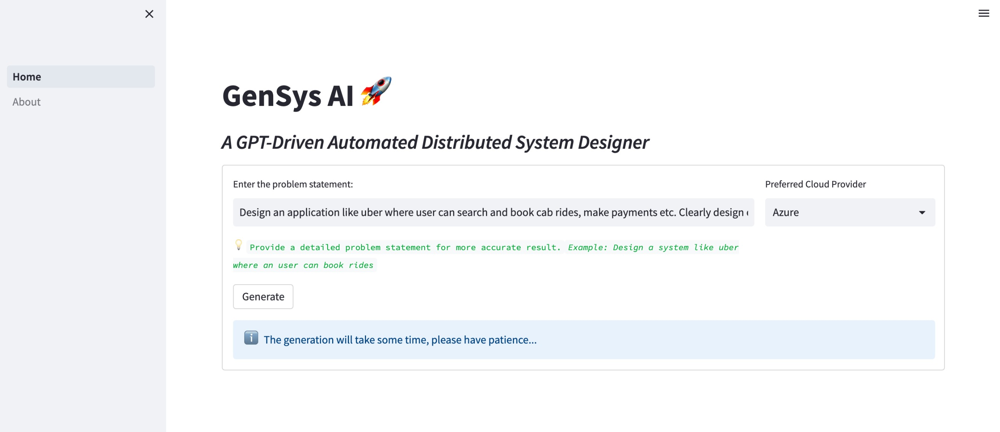

# GenSysAI: GPT-Driven Automated Distributed System Designer

GenSysAI is an experimental tool based on LLM that can help you design a distributed system from a well defined problem statement.

---




## Motivation

While designing a large-scale distributed system, an individual Software Enginner or Architect has limitations on the knowledge of not only different strategies but technologies from different cloud providers.

Although researching about the problem, reading different blogs, books and papers give a detailed idea about them, this tool aims to provide a comprehensive gist of a distributed system that you would want to design. This can help in focused research while designing a system, even can help you prepare for interviews.

This is not a perfect solution, but this is an aid to you to create a more perfect solution.


## Usage Guidelines

If you want to run on terminal, Checkout the [main.py](./main.py) and run

``shell
pip install -r requirements.txt
```

```shell
python main.py
```
Otherwise to run the streamlit application, run

```shell
streamlit run Home.py
```


## Samples

Checkout the [Samples](./samples/) directory, for Experimental notebooks and generated design doc.

The above demo is generated from the problem statement - 
>_Design an instagram like photo sharing application where users can post photo or videos, can follow other users, browse through the posted photos and videos by the following users, like and comment on the posts by following users._

## Next Steps

1. Prompt engineering to get better results.
2. Contextual design for selected components to avoid generic answers, e.g. - database design considering the service requirements, Optional caching requirement based on the database access patterns etc.
3. Accomodate non-functional requirements - scale, throughput etc.
4. Iterative review of the generated design and auto correct and self-improve. Identify crucial scenarios like cache stampede and answers on tackling them.
5. Experiments with different GPT models and create a benchmark.

## Contribution

1. Feel free to Contribute to this project. 
2. There are few features I have in mind as called out in the Next Steps section. Please raise an issue with the detailed feature requests.


> :bulb: Fun Fact : This project name was generated by ChatGPT.
